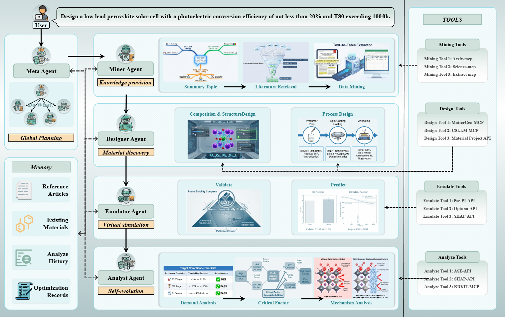

# PeroMAS: A Multi-agent System of Perovskite Material Discovery

[](https://www.python.org/downloads/)
[](https://langchain-ai.github.io/langgraph/)
[](https://opensource.org/licenses/MIT)

---

## 📖 Overview

**PeroMAS** is an autonomous multi-agent system designed to accelerate perovskite solar cell (PSC) research through AI-driven automation. The system orchestrates six specialized AI agents that collaborate to execute a complete research pipeline:

```
Literature Review → Material Design → Performance Prediction → Analysis → Knowledge Archival → Iterative Optimization
```

The system employs a **cyclic research workflow** based on the PDCA (Plan-Do-Check-Act) methodology, enabling continuous hypothesis refinement and performance optimization until research objectives are achieved.

### Key Features

- **Autonomous Multi-Agent Coordination**: Six specialized agents with distinct roles collaborate through a shared state machine
- **Iterative Optimization Loop**: Automatic hypothesis generation, testing, and refinement across multiple iterations
- **Domain-Specific AI Tools**: Integration with materials science tools (MatterGen, CSLLM, pymatgen, RDKit)
- **Literature-Informed Design**: Real-time arXiv paper retrieval and structured data extraction
- **ML-Based Performance Prediction**: Random Forest models trained on perovskite datasets
- **Interpretable Analysis**: SHAP-based feature importance analysis for scientific insights

---

## 🏗️ System Architecture



### Three-Layer Design

| Layer | Function | Components |
|-------|----------|------------|
| **Workflow Layer** | Agent orchestration and state management | LangGraph StateGraph, Cyclic execution loop |
| **Tool Layer** | Domain-specific scientific capabilities | MCP servers, ML models, Chemistry libraries |
| **LLM Layer** | Reasoning and natural language understanding | Multi-provider LLM support via LangChain |

---

## 🤖 Agent Definitions

The system consists of six specialized agents, each responsible for a specific phase of the research workflow:

| Agent | Role | Input | Output |
|-------|------|-------|--------|
| **MetaAgent** | Chief Scientist | goal, memory_log, analysis_report | Strategic plan with hypothesis and agent tasks |
| **Miner Agent** | Literature Intelligence | goal, plan | Literature findings and extracted data |
| **DesignAgent** | Experimental Designer | goal, plan, data_context | Material composition and synthesis recipe |
| **Emulator Agent** | Virtual Fabrication | experimental_params | Predicted performance metrics (PCE, Voc, Jsc, FF) |
| **AnalysisAgent** | Lead Analyst | all upstream outputs | Gap analysis and root cause diagnosis |
| **MemoryAgent** | Knowledge Keeper | all fields | Archived knowledge capsule for next iteration |

### Agent Capabilities

- **MetaAgent**: Pure reasoning agent for strategic planning, hypothesis generation, and termination decisions. No tools - relies entirely on LLM reasoning.

- **Miner Agent**: Searches scientific literature (arXiv), downloads papers, and extracts structured experimental data using LLM-powered extraction.

- **DesignAgent**: Generates candidate material compositions using MatterGen, verifies synthesizability using CSLLM (TPR=98.8%), and predicts synthesis routes and precursors.

- **Emulator Agent**: Predicts solar cell performance using trained Random Forest models with Composition-Based Feature Vectors (CBFV).

- **AnalysisAgent**: Performs chemical analysis (stoichiometry, organic cation properties), mechanism diagnosis, and SHAP-based feature importance analysis.

- **MemoryAgent**: Extracts knowledge triplets (Formula, PCE, Reason), archives experimental records, and detects trends across iterations.

---

## 🔄 Workflow Mechanism

### Cyclic State Machine

The workflow implements a cyclic execution pattern using LangGraph's StateGraph:

```
Entry Point ──► MetaAgent ──► [Termination Check]
                                    │
                    ┌───────────────┴───────────────┐
                    ▼                               ▼
                [Continue]                        [End]
                    │
                    ▼
              Miner Agent ──► DesignAgent ──► Emulator Agent ──► AnalysisAgent ──► MemoryAgent
                                                                               │
                                                                               ▼
                                                                         Loop back to MetaAgent
```

### Termination Conditions

1. **Goal Achievement**: MetaAgent determines research objective is met
2. **Safety Limit**: Maximum iteration count reached (default: 10)
3. **Early Termination**: MetaAgent identifies goal as clearly unachievable

### Shared State Definition

All agents read from and write to a shared state dictionary:

| Field | Writer | Description |
|-------|--------|-------------|
| `goal` | User | Research objective |
| `plan` | MetaAgent | Strategic plan with hypothesis and tasks |
| `data_context` | Miner Agent | Literature findings |
| `experimental_params` | DesignAgent | Material recipe |
| `fab_results` | Emulator Agent | Predicted metrics |
| `analysis_report` | AnalysisAgent | Gap analysis |
| `memory_log` | MemoryAgent | Archived knowledge (append-only) |
| `current_iteration` | Workflow | Loop counter |
| `is_finished` | MetaAgent | Termination flag |

---

## 📁 Project Structure

```
PeroMAS/
├── src/
│   ├── agent/                    # Agent implementations
│   │   ├── meta_agent.py         # Strategic planning
│   │   ├── data_agent.py         # Literature retrieval
│   │   ├── design_agent.py       # Material design
│   │   ├── fab_agent.py          # Emulator agent (performance prediction)
│   │   ├── analysis_agent.py     # Gap analysis
│   │   └── memory_agent.py       # Knowledge archival
│   │
│   ├── core/                     # Core infrastructure
│   │   ├── base_agent.py         # BaseAgent with LLM & tool support
│   │   ├── config.py             # Configuration management
│   │   ├── llm.py                # Multi-provider LLM client
│   │   └── tool.py               # MCP tool registry
│   │
│   ├── workflow/                 # Workflow orchestration
│   │   ├── graph.py              # LangGraph workflow definition
│   │   └── state.py              # Shared state definition
│   │
│   └── test/                     # Experiment scripts
│
├── mcp/                          # Tool implementations
│   ├── analysis_agent/           # Chemistry & SHAP tools
│   ├── data_agent/               # ArXiv MCP server
│   ├── design_agent/             # MatterGen & CSLLM interface
│   └── fab_agent/                # RF prediction models
│
├── dataset/                      # Training data & models
│   ├── CSLLM/                    # Synthesis prediction models
│   └── mattergen/                # Structure generation data
│
└── docs/                         # Documentation
```

---

## 🔬 Technical Approach

### Algorithm Overview

```
Input: Research Goal (e.g., "Design PCE > 25% perovskite")
Output: Optimized Material Recipe + Performance Prediction

1. Initialize state with goal
2. WHILE not terminated AND iteration < max_iterations:
   a. MetaAgent: Analyze memory → Generate hypothesis → Assign tasks
    b. Miner Agent: Search literature → Extract relevant data
   c. DesignAgent: Generate candidates → Verify synthesizability
    d. Emulator Agent: Predict performance using ML models
   e. AnalysisAgent: Compare with target → Diagnose gaps
   f. MemoryAgent: Archive knowledge capsule
   g. iteration += 1
3. Return final state with best material recipe
```

### Key Technologies

| Component | Technology | Purpose |
|-----------|------------|---------|
| Workflow Engine | LangGraph | Agent orchestration, state management |
| Tool Protocol | MCP (Model Context Protocol) | Standardized tool integration |
| LLM Integration | LangChain | Multi-provider LLM abstraction |
| Synthesis Prediction | CSLLM | Crystal synthesizability (TPR=98.8%) |
| Structure Generation | MatterGen | Candidate material generation |
| Property Prediction | Random Forest + CBFV | PCE, Voc, Jsc, FF prediction |
| Chemical Analysis | pymatgen, RDKit | Stoichiometry, molecular properties |
| Interpretability | SHAP | Feature importance analysis |

### Supported Research Tasks

- Composition optimization for target PCE
- Lead-free perovskite design
- Stability optimization (thermal, moisture)
- Bandgap engineering for tandem cells
- Mixed-cation ratio optimization
- 2D/3D perovskite structure design
- Performance mechanism analysis

---

## 🚀 Quick Start

### Installation

```bash
git clone https://github.com/yishu031031/perovskite_agent.git
cd PeroMAS
pip install -r requirements.txt
```

### Configuration

Create `.env` file with LLM API credentials:
```env
LLM_PROVIDER=openai
OPENAI_API_KEY=your-api-key
OPENAI_MODEL=gpt-4o
```

### Run

```bash
cd src/test
python workflow_test.py --query "Design PCE > 25% perovskite"
```

---

## 📚 References

- **LangGraph**: https://langchain-ai.github.io/langgraph/
- **MCP Protocol**: https://modelcontextprotocol.io/
- **CSLLM**: https://arxiv.org/abs/2407.07016
- **pymatgen**: https://pymatgen.org/
- **SHAP**: https://shap.readthedocs.io/

---

## 📝 License

MIT License

---

## Citation

```bibtex
```
